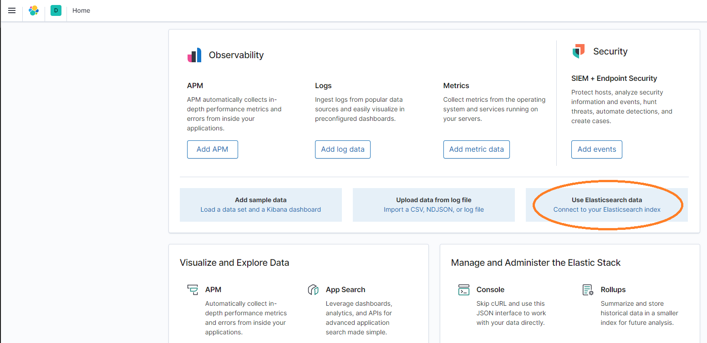

Vessel Tracker
===
Abstract: [Orignial Marine Traffic ReadMe](https://github.com/marinetraffic/backend-assignment#readme)
## Project Information
- Title:  `Vessel Tracker API`
- Authors:  `Athanasios Koumpouras`

## Code Details
### Implementation decisions
* I'm using **Symfony 5.4** framework for the REST API. 
* I have decided that elastic search will be more efficient for this type of problem. Elasticsearch has been built for search, supporting **geo_shape** and **geo_point** that can be used to calculate distances and area.
* I have only one entry point (GET). All the filters can be applied to the same request
* Population of the elastic search will happen at the boot-up of the PHP container in case this stack can be used for testing
* Using Redis for caching and limiting requests (pool)
* I'm forwarding all the logs to Kibana. I'm still keeping local logs.
* Build for the cloud. No session stickiness nor file stickiness.


### Dependencies
- docker
- docker-compose

### Stack
| Image | Version | Port |Use | 
| ---     | ---   | ---   | ---   |
| Elasticsearch | 7.9.3 | 9200 | Holds the ship positions |
| Kibana | 7.9.3 | 5601 |For logging and data mining|
| PHP | 8.1 FPM | 9000  | Personal Home Page :) |
| NGINX | latest | 8000 |WebServer  |
| Xdebug | 3 | 9003 | Debugging  |
| Redis | latest | 5392 |cache and limit-requests /s  |

### Use
- Build the project
  ```
  docker-compose build
  ```
- Start the project
  ```
  docker-compose up -d
  docker-compose logs -f
  ```
  Launch your browser at http://localhost:8000. 
  You can start interrogating the API using curl 
  ``` 
  curl -X 'GET' 'http://localhost:8000/api/v1/locations?page=1&geolocation=42.65908%2C15.54455' -H 'accept: application/ld+json'
  ```
- Stop the project
  ```
  docker-compose down
  ```
  Stop the project and delete the volumes. 
  ```
  docker-compose down -v
  ```
### Urls
| URI | Description | 
| --- | ---   | 
| http://localhost:9200 | Elasticsearch |
| http://localhost:5601 | Kibana |
| http://localhost:8000 | Landing page  |
| http://localhost:8000/docs | Swagger page (dev mode only)  |
| http://localhost:8000/_profiler/ | Debugger (dev mode only)  |
| http://localhost:8000/docs?ui=re_doc | re-doc (dev mode only)  |
| http://localhost:8000/api/v1/locations | Vessel tracker API  |


## Supported content types
| Model | Header | example |
| ---     | ---   | ---   | 
| json-ld | application/ld+json| [json-ld](#json-ld) |
| json-hal | application/hal+json |  [json-hal](#json-hal) |
| json-api | application/vnd.api+json | [json-api](#json-api) |
| json | application/json | [json](#json) |
| xml | application/xml | [xml](#xml) |
| text-xml | text/xml | [text/xml](#textxml) |
| yaml | application/x-yaml | [yaml](#yaml) |
| csv | text/csv | [csv](#csv) |


## json-ld
Request
```bash
curl -X 'GET' \
  'http://localhost:8000/api/v1/locations?page=1&geolocation=42.48938%2C15.7496%2C1' \
  -H 'accept: application/ld+json'
```
Headers
```
 cache-control: no-cache,private 
 connection: keep-alive 
 content-type: application/ld+json; charset=utf-8 
 date: Sun,13 Mar 2022 16:10:48 GMT 
 etag: "683f7dcb5a35b6e59864102aef94c2db" 
 link: <http://localhost:8000/api/v1/docs.jsonld>; rel="http://www.w3.org/ns/hydra/core#apiDocumentation" 
 server: nginx/1.21.6 
 transfer-encoding: chunked 
 vary: Accept 
 x-content-type-options: nosniff 
 x-debug-token: b0b485 
 x-debug-token-link: http://localhost:8000/_profiler/b0b485 
 x-frame-options: deny 
 x-powered-by: PHP/8.1.3 
 x-ratelimit-limit: 1000 
 x-ratelimit-remaining: 999 
 x-ratelimit-reset: 1647187908 
 x-robots-tag: noindex 
```

Response
```JSON
{
  "@context": "/api/v1/contexts/Location",
  "@id": "/api/v1/locations",
  "@type": "hydra:Collection",
  "hydra:member": [
    {
      "@type": "Location",
      "@id": "/api/v1/locations/247039300",
      "mmsi": 247039300,
      "timestamp": "2013-07-01T17:39:00+00:00",
      "speed": 15.4,
      "geoLocation": {
        "@type": "GeoLocationOutput",
        "@id": "_:1300",
        "lat": 42.48938,
        "lon": 15.7496
      }
    },
    {
      "@type": "Location",
      "@id": "/api/v1/locations/247039300",
      "mmsi": 247039300,
      "timestamp": "2013-07-01T17:42:00+00:00",
      "speed": 15.5,
      "geoLocation": {
        "@type": "GeoLocationOutput",
        "@id": "_:1134",
        "lat": 42.48565,
        "lon": 15.75362
      }
    },
    {
      "@type": "Location",
      "@id": "/api/v1/locations/247039300",
      "mmsi": 247039300,
      "timestamp": "2013-07-01T17:36:00+00:00",
      "speed": 15.4,
      "geoLocation": {
        "@type": "GeoLocationOutput",
        "@id": "_:1012",
        "lat": 42.49308,
        "lon": 15.74558
      }
    }
  ],
  "hydra:totalItems": 3,
  "hydra:view": {
    "@id": "/api/v1/locations?geolocation=42.48938%2C15.7496%2C1",
    "@type": "hydra:PartialCollectionView"
  },
  "hydra:search": {
    "@type": "hydra:IriTemplate",
    "hydra:template": "/api/v1/locations{?timestamp,mmsi,mmsi[],geolocation}",
    "hydra:variableRepresentation": "BasicRepresentation",
    "hydra:mapping": [
      {
        "@type": "IriTemplateMapping",
        "variable": "timestamp",
        "property": "timestamp",
        "required": false
      },
      {
        "@type": "IriTemplateMapping",
        "variable": "mmsi",
        "property": "mmsi",
        "required": false
      },
      {
        "@type": "IriTemplateMapping",
        "variable": "mmsi[]",
        "property": "mmsi",
        "required": false
      },
      {
        "@type": "IriTemplateMapping",
        "variable": "geolocation",
        "property": "geolocation",
        "required": false
      }
    ]
  }
}
```

## json-hal
Request
```bash
curl -X 'GET' \
  'http://localhost:8000/api/v1/locations?page=1&geolocation=42.48938%2C15.7496%2C1' \
  -H 'accept: application/hal+json'
```
Headers
```
 cache-control: no-cache,private 
 connection: keep-alive 
 content-type: application/hal+json; charset=utf-8 
 date: Sun,13 Mar 2022 16:14:43 GMT 
 etag: "ce888b1cf784c74976a8b1ff2857293b" 
 link: <http://localhost:8000/api/v1/docs.jsonld>; rel="http://www.w3.org/ns/hydra/core#apiDocumentation" 
 server: nginx/1.21.6 
 transfer-encoding: chunked 
 vary: Accept 
 x-content-type-options: nosniff 
 x-debug-token: 12b890 
 x-debug-token-link: http://localhost:8000/_profiler/12b890 
 x-frame-options: deny 
 x-powered-by: PHP/8.1.3 
 x-ratelimit-limit: 1000 
 x-ratelimit-remaining: 999 
 x-ratelimit-reset: 1647188143 
 x-robots-tag: noindex 
```
Response
```JSON
{
  "_links": {
    "self": {
      "href": "/api/v1/locations?geolocation=42.48938%2C15.7496%2C1"
    },
    "item": [
      {
        "href": "/api/v1/locations/247039300"
      },
      {
        "href": "/api/v1/locations/247039300"
      },
      {
        "href": "/api/v1/locations/247039300"
      }
    ]
  },
  "totalItems": 3,
  "itemsPerPage": 30,
  "_embedded": {
    "item": [
      {
        "_links": {
          "self": {
            "href": "/api/v1/locations/247039300"
          }
        },
        "mmsi": 247039300,
        "timestamp": "2013-07-01T17:39:00+00:00",
        "speed": 15.4,
        "geoLocation": {
          "lat": 42.48938,
          "lon": 15.7496
        }
      },
      {
        "_links": {
          "self": {
            "href": "/api/v1/locations/247039300"
          }
        },
        "mmsi": 247039300,
        "timestamp": "2013-07-01T17:42:00+00:00",
        "speed": 15.5,
        "geoLocation": {
          "lat": 42.48565,
          "lon": 15.75362
        }
      },
      {
        "_links": {
          "self": {
            "href": "/api/v1/locations/247039300"
          }
        },
        "mmsi": 247039300,
        "timestamp": "2013-07-01T17:36:00+00:00",
        "speed": 15.4,
        "geoLocation": {
          "lat": 42.49308,
          "lon": 15.74558
        }
      }
    ]
  }
}
```


## json-api
Request
```bash
curl -X 'GET' \
  'http://localhost:8000/api/v1/locations?page=1&geolocation=42.48938%2C15.7496%2C1' \
  -H 'accept: application/vnd.api+json'
```
Headers
```
 cache-control: no-cache,private 
 connection: keep-alive 
 content-type: application/vnd.api+json; charset=utf-8 
 date: Sun,13 Mar 2022 16:17:11 GMT 
 etag: "32bc0199ec7e3b99a8c685da6aa43255" 
 link: <http://localhost:8000/api/v1/docs.jsonld>; rel="http://www.w3.org/ns/hydra/core#apiDocumentation" 
 server: nginx/1.21.6 
 transfer-encoding: chunked 
 vary: Accept 
 x-content-type-options: nosniff 
 x-debug-token: 434b3c 
 x-debug-token-link: http://localhost:8000/_profiler/434b3c 
 x-frame-options: deny 
 x-powered-by: PHP/8.1.3 
 x-ratelimit-limit: 1000 
 x-ratelimit-remaining: 999 
 x-ratelimit-reset: 1647188291 
 x-robots-tag: noindex 
```
Response
```JSON
{
  "links": {
    "self": "/api/v1/locations?geolocation=42.48938%2C15.7496%2C1"
  },
  "meta": {
    "totalItems": 3,
    "itemsPerPage": 30,
    "currentPage": 1
  },
  "data": [
    {
      "id": "/api/v1/locations/247039300",
      "type": "Location",
      "attributes": {
        "mmsi": 247039300,
        "timestamp": "2013-07-01T17:39:00+00:00",
        "speed": 15.4,
        "geoLocation": {
          "data": {
            "id": 1278,
            "type": "GeoLocationOutput",
            "attributes": {
              "lat": 42.48938,
              "lon": 15.7496
            }
          }
        }
      }
    },
    {
      "id": "/api/v1/locations/247039300",
      "type": "Location",
      "attributes": {
        "mmsi": 247039300,
        "timestamp": "2013-07-01T17:42:00+00:00",
        "speed": 15.5,
        "geoLocation": {
          "data": {
            "id": 1111,
            "type": "GeoLocationOutput",
            "attributes": {
              "lat": 42.48565,
              "lon": 15.75362
            }
          }
        }
      }
    },
    {
      "id": "/api/v1/locations/247039300",
      "type": "Location",
      "attributes": {
        "mmsi": 247039300,
        "timestamp": "2013-07-01T17:36:00+00:00",
        "speed": 15.4,
        "geoLocation": {
          "data": {
            "id": 1109,
            "type": "GeoLocationOutput",
            "attributes": {
              "lat": 42.49308,
              "lon": 15.74558
            }
          }
        }
      }
    }
  ]
}
```

## JSON
Request
```bash
curl -X 'GET' \
  'http://localhost:8000/api/v1/locations?page=1&geolocation=42.48938%2C15.7496%2C1' \
  -H 'accept: application/json'
```
Headers
```
cache-control: no-cache,private 
 connection: keep-alive 
 content-encoding: gzip 
 content-type: application/json; charset=utf-8 
 date: Sun,13 Mar 2022 16:18:51 GMT 
 etag: W/"a19995b515142d35af83d477148e9c91" 
 link: <http://localhost:8000/api/v1/docs.jsonld>; rel="http://www.w3.org/ns/hydra/core#apiDocumentation" 
 server: nginx/1.21.6 
 transfer-encoding: chunked 
 vary: Accept 
 x-content-type-options: nosniff 
 x-debug-token: 9914dc 
 x-debug-token-link: http://localhost:8000/_profiler/9914dc 
 x-frame-options: deny 
 x-powered-by: PHP/8.1.3 
 x-ratelimit-limit: 1000 
 x-ratelimit-remaining: 999 
 x-ratelimit-reset: 1647188391 
 x-robots-tag: noindex 
```
Response
```JSON
[
  {
    "mmsi": 247039300,
    "timestamp": "2013-07-01T17:39:00+00:00",
    "speed": 15.4,
    "geoLocation": {
      "lat": 42.48938,
      "lon": 15.7496
    }
  },
  {
    "mmsi": 247039300,
    "timestamp": "2013-07-01T17:42:00+00:00",
    "speed": 15.5,
    "geoLocation": {
      "lat": 42.48565,
      "lon": 15.75362
    }
  },
  {
    "mmsi": 247039300,
    "timestamp": "2013-07-01T17:36:00+00:00",
    "speed": 15.4,
    "geoLocation": {
      "lat": 42.49308,
      "lon": 15.74558
    }
  }
]
```

## XML
Request
```bash
curl -X 'GET' \
  'http://localhost:8000/api/v1/locations?page=1&geolocation=42.48938%2C15.7496%2C1' \
  -H 'accept: application/xml'
```
Headers
```
 cache-control: no-cache,private 
 connection: keep-alive 
 content-type: application/xml; charset=utf-8 
 date: Sun,13 Mar 2022 16:20:36 GMT 
 etag: "691d7525777eb2244676f514e870314f" 
 link: <http://localhost:8000/api/v1/docs.jsonld>; rel="http://www.w3.org/ns/hydra/core#apiDocumentation" 
 server: nginx/1.21.6 
 transfer-encoding: chunked 
 vary: Accept 
 x-content-type-options: nosniff 
 x-debug-token: 583d10 
 x-debug-token-link: http://localhost:8000/_profiler/583d10 
 x-frame-options: deny 
 x-powered-by: PHP/8.1.3 
 x-ratelimit-limit: 1000 
 x-ratelimit-remaining: 999 
 x-ratelimit-reset: 1647188496 
 x-robots-tag: noindex 
```
Response
```xml
<?xml version="1.0"?>
  <response>
    <item key="0">
      <mmsi>247039300</mmsi>
      <timestamp>2013-07-01T17:39:00+00:00</timestamp>
      <speed>15.4</speed>
      <geoLocation>
        <lat>42.48938</lat>
        <lon>15.7496</lon>
      </geoLocation>
    </item>
    <item key="1">
      <mmsi>247039300</mmsi>
      <timestamp>2013-07-01T17:42:00+00:00</timestamp>
      <speed>15.5</speed>
      <geoLocation>
        <lat>42.48565</lat>
        <lon>15.75362</lon>
      </geoLocation>
    </item>
    <item key="2">
      <mmsi>247039300</mmsi>
      <timestamp>2013-07-01T17:36:00+00:00</timestamp>
      <speed>15.4</speed>
      <geoLocation>
        <lat>42.49308</lat>
        <lon>15.74558</lon>
      </geoLocation>
    </item>
  </response>
```

## Text/XML
Request
```bash
curl -X 'GET' \
  'http://localhost:8000/api/v1/locations?page=1&geolocation=42.48938%2C15.7496%2C1' \
  -H 'accept: text/xml'
```
Headers
```
 cache-control: no-cache,private 
 connection: keep-alive 
 content-type: application/xml; charset=utf-8 
 date: Sun,13 Mar 2022 16:23:53 GMT 
 etag: "691d7525777eb2244676f514e870314f" 
 link: <http://localhost:8000/api/v1/docs.jsonld>; rel="http://www.w3.org/ns/hydra/core#apiDocumentation" 
 server: nginx/1.21.6 
 transfer-encoding: chunked 
 vary: Accept 
 x-content-type-options: nosniff 
 x-debug-token: 529f3e 
 x-debug-token-link: http://localhost:8000/_profiler/529f3e 
 x-frame-options: deny 
 x-powered-by: PHP/8.1.3 
 x-ratelimit-limit: 1000 
 x-ratelimit-remaining: 999 
 x-ratelimit-reset: 1647188693 
 x-robots-tag: noindex 
```
Response
```xml
<?xml version="1.0"?>
  <response>
    <item key="0">
      <mmsi>247039300</mmsi>
      <timestamp>2013-07-01T17:39:00+00:00</timestamp>
      <speed>15.4</speed>
      <geoLocation>
        <lat>42.48938</lat>
        <lon>15.7496</lon>
      </geoLocation>
    </item>
    <item key="1">
      <mmsi>247039300</mmsi>
      <timestamp>2013-07-01T17:42:00+00:00</timestamp>
      <speed>15.5</speed>
      <geoLocation>
        <lat>42.48565</lat>
        <lon>15.75362</lon>
      </geoLocation>
    </item>
    <item key="2">
      <mmsi>247039300</mmsi>
      <timestamp>2013-07-01T17:36:00+00:00</timestamp>
      <speed>15.4</speed>
      <geoLocation>
        <lat>42.49308</lat>
        <lon>15.74558</lon>
      </geoLocation>
    </item>
  </response>
```

## YAML
Request
```bash
curl -X 'GET' \
  'http://localhost:8000/api/v1/locations?page=1&geolocation=42.48938%2C15.7496%2C1' \
  -H 'accept: application/x-yaml'
```
Headers
```
 cache-control: no-cache,private 
 connection: keep-alive 
 content-type: application/x-yaml; charset=utf-8 
 date: Sun,13 Mar 2022 16:26:14 GMT 
 etag: "5cdfea4a3ebca21b96b7714869354089" 
 link: <http://localhost:8000/api/v1/docs.jsonld>; rel="http://www.w3.org/ns/hydra/core#apiDocumentation" 
 server: nginx/1.21.6 
 transfer-encoding: chunked 
 vary: Accept 
 x-content-type-options: nosniff 
 x-debug-token: dc1cd2 
 x-debug-token-link: http://localhost:8000/_profiler/dc1cd2 
 x-frame-options: deny 
 x-powered-by: PHP/8.1.3 
 x-ratelimit-limit: 1000 
 x-ratelimit-remaining: 999 
 x-ratelimit-reset: 1647188834 
 x-robots-tag: noindex 
```
Responses
```YAML
[{ mmsi: 247039300, timestamp: '2013-07-01T17:39:00+00:00', speed: 15.4, geoLocation: { lat: 42.48938, lon: 15.7496 } }, { mmsi: 247039300, timestamp: '2013-07-01T17:42:00+00:00', speed: 15.5, geoLocation: { lat: 42.48565, lon: 15.75362 } }, { mmsi: 247039300, timestamp: '2013-07-01T17:36:00+00:00', speed: 15.4, geoLocation: { lat: 42.49308, lon: 15.74558 } }]
```

## CSV
Request
```bash
curl -X 'GET' \
  'http://localhost:8000/api/v1/locations?page=1&geolocation=42.48938%2C15.7496%2C1' \
  -H 'accept: text/csv'
```
Headers
```
 cache-control: no-cache,private 
 connection: keep-alive 
 content-type: text/csv; charset=utf-8 
 date: Sun,13 Mar 2022 16:27:28 GMT 
 etag: "b9bcdcbe8d403841c456efd44ec64d6c" 
 link: <http://localhost:8000/api/v1/docs.jsonld>; rel="http://www.w3.org/ns/hydra/core#apiDocumentation" 
 server: nginx/1.21.6 
 transfer-encoding: chunked 
 vary: Accept 
 x-content-type-options: nosniff 
 x-debug-token: 253349 
 x-debug-token-link: http://localhost:8000/_profiler/253349 
 x-frame-options: deny 
 x-powered-by: PHP/8.1.3 
 x-ratelimit-limit: 1000 
 x-ratelimit-remaining: 999 
 x-ratelimit-reset: 1647188908 
 x-robots-tag: noindex 
```
Response
```csv
mmsi,timestamp,speed,geoLocation.lat,geoLocation.lon
247039300,2013-07-01T17:39:00+00:00,15.4,42.48938,15.7496
247039300,2013-07-01T17:42:00+00:00,15.5,42.48565,15.75362
247039300,2013-07-01T17:36:00+00:00,15.4,42.49308,15.74558
```

## Limit request per user IP
Using Redis to store the request. We are also passing headers in case a Redis is not available. 
```
 x-ratelimit-limit: 10 #user limit request
 x-ratelimit-remaining: 9 #user request remaining
 x-ratelimit-reset: 1647187661 #Expiration time of limit
```
# Access Kibana



## Extra features I would like to add.
* A database can be used as storage (write queries) and elastic search can do all the (read queries). 
* Event system to update the elastic search from a Doctrine prospective
* All the (write queries) can be sent to a queue to eliminate a single point of failure
* Rotation on logs (for local logs files)
* Improve testing (add more tests)

### Tested Platform
```
OS: Windows 11 with WSL 2 (Ubuntu 20.04)
OS: Linux Ubuntu 20.04
```
## References
- [api-platform](https://api-platform.com)
- [symfony](https://symfony.com)
  